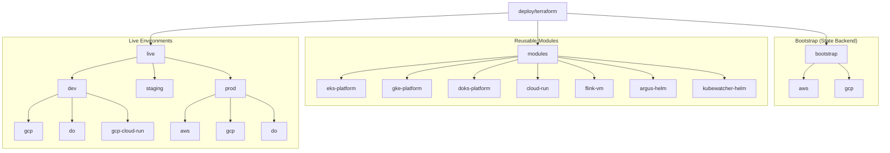
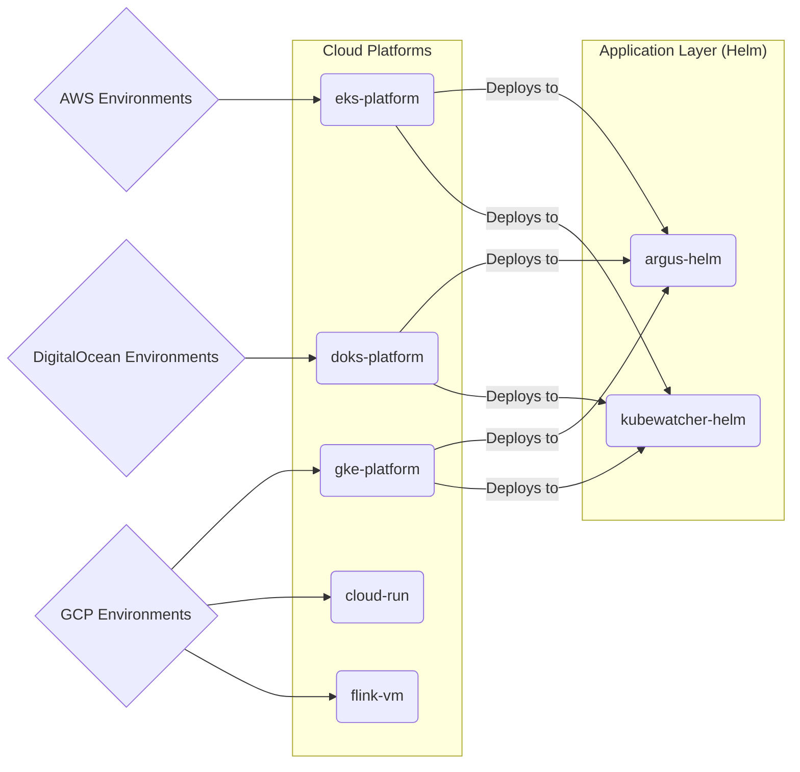
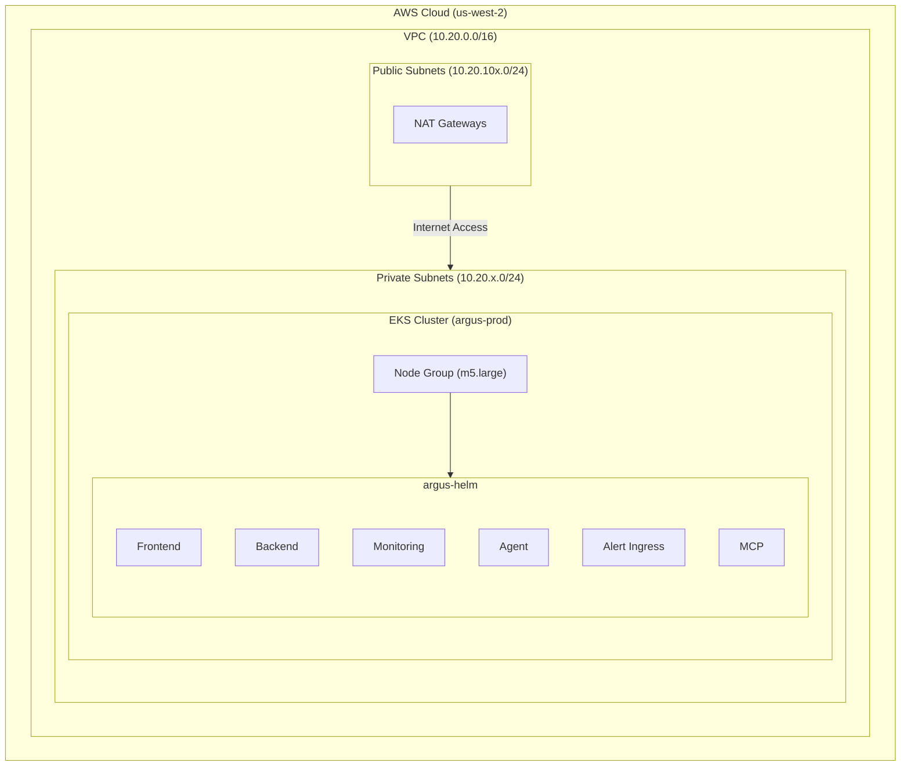

# Terraform Architecture and Organization

This document provides a visual overview of the Terraform architecture and organization for the Argus project, using Mermaid diagrams.

## 1. High-Level Repository Structure

This graph illustrates how the repository separates reusable modules from live environment configurations.

## 2. Module Dependency Map

This diagram demonstrates how the live environments consume custom modules to deploy the infrastructure and applications (Helm charts) across cloud providers.

## 3. AWS Production Architecture (Example)

Based on the `live/prod/aws/main.tf` configuration, this represents the actual architecture deployed when applying the AWS Prod stack.

